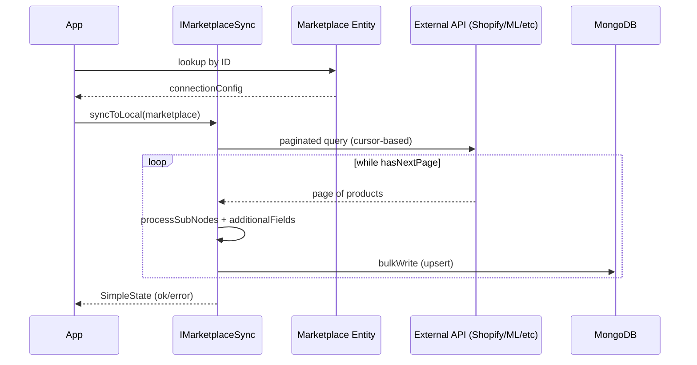
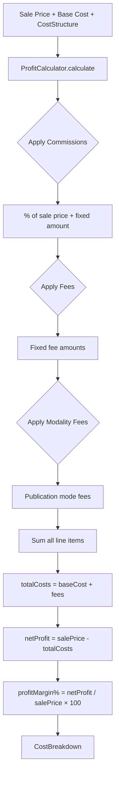
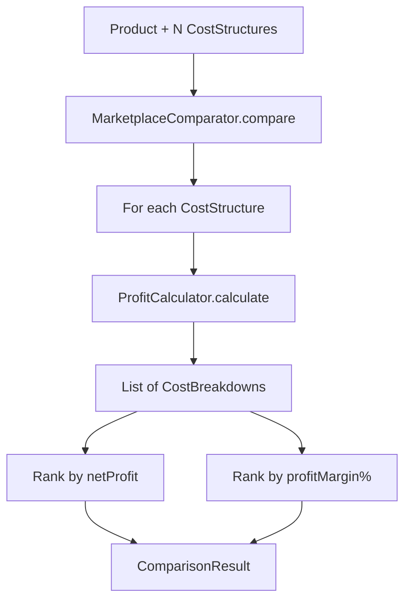
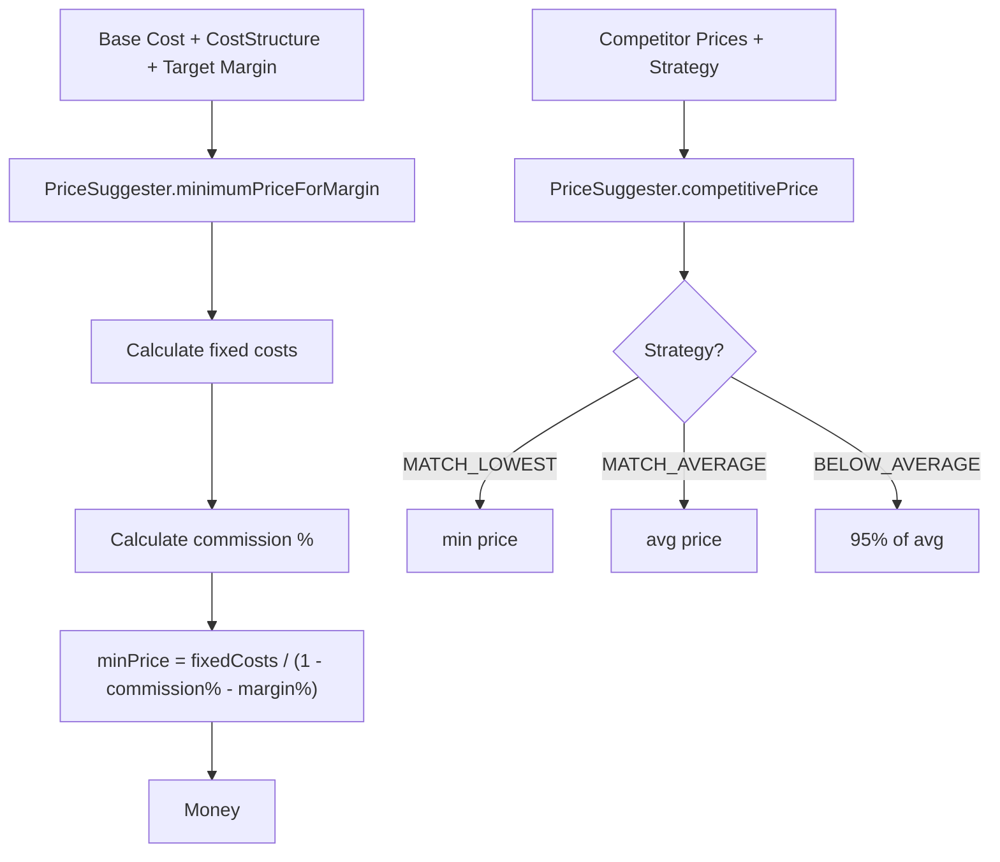

# MarketPlazeLib — Flowcharts

## Sync Flow

```mermaid
sequenceDiagram
    participant App
    participant SyncEngine as IMarketplaceSync
    participant Marketplace as Marketplace Entity
    participant API as External API (Shopify/ML/etc)
    participant DB as MongoDB

    App->>Marketplace: lookup by ID
    Marketplace-->>App: connectionConfig
    App->>SyncEngine: syncToLocal(marketplace)
    SyncEngine->>API: paginated query (cursor-based)
    loop while hasNextPage
        API-->>SyncEngine: page of products
        SyncEngine->>SyncEngine: processSubNodes + additionalFields
        SyncEngine->>DB: bulkWrite (upsert)
    end
    SyncEngine-->>App: SimpleState (ok/error)
```

## Profit Calculation Flow

```mermaid
flowchart TD
    A[Sale Price + Base Cost + CostStructure] --> B[ProfitCalculator.calculate]
    B --> C{Apply Commissions}
    C --> D[% of sale price + fixed amount]
    D --> E{Apply Fees}
    E --> F[Fixed fee amounts]
    F --> G{Apply Modality Fees}
    G --> H[Publication mode fees]
    H --> I[Sum all line items]
    I --> J[totalCosts = baseCost + fees]
    J --> K[netProfit = salePrice - totalCosts]
    K --> L[profitMargin% = netProfit / salePrice × 100]
    L --> M[CostBreakdown]
```

## Marketplace Comparison Flow

```mermaid
flowchart TD
    A[Product + N CostStructures] --> B[MarketplaceComparator.compare]
    B --> C[For each CostStructure]
    C --> D[ProfitCalculator.calculate]
    D --> E[List of CostBreakdowns]
    E --> F[Rank by netProfit]
    E --> G[Rank by profitMargin%]
    F --> H[ComparisonResult]
    G --> H
```

## Price Suggestion Flow

```mermaid
flowchart TD
    A[Base Cost + CostStructure + Target Margin] --> B[PriceSuggester.minimumPriceForMargin]
    B --> C[Calculate fixed costs]
    C --> D[Calculate commission %]
    D --> E["minPrice = fixedCosts / (1 - commission% - margin%)"]
    E --> F[Money]

    G[Competitor Prices + Strategy] --> H[PriceSuggester.competitivePrice]
    H --> I{Strategy?}
    I -->|MATCH_LOWEST| J[min price]
    I -->|MATCH_AVERAGE| K[avg price]
    I -->|BELOW_AVERAGE| L[95% of avg]
```
